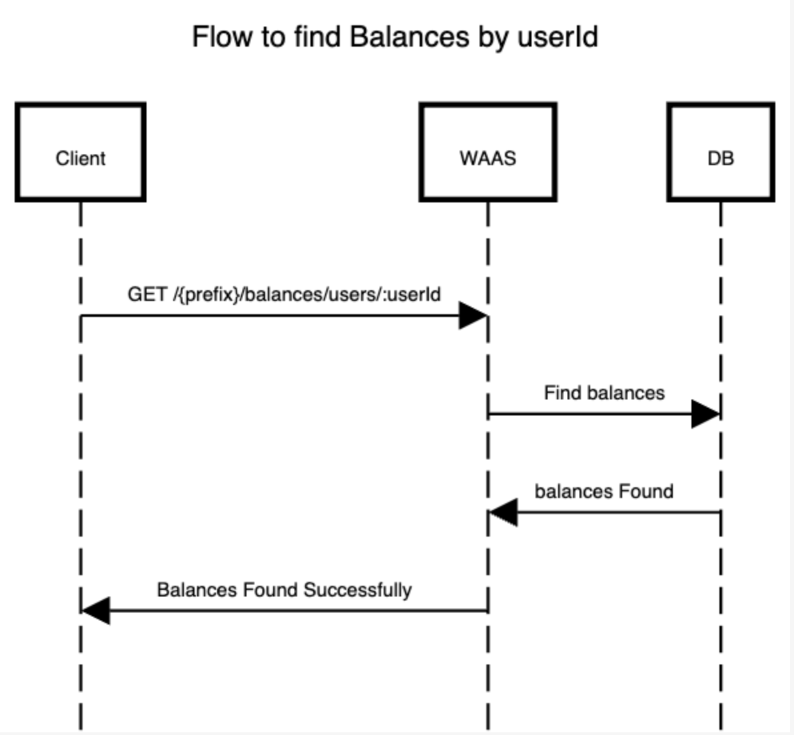

# Obtener Balances de un Usuario por ID

Recupera los saldos de un usuario para los tokens. Esta solicitud admite un parámetro opcional `tokenId`, que filtra los saldos del usuario por el token especificado. Si no se proporciona se devolverán los saldos del usuario para todos los tokens.

### `GET` /{prefix}/balances/users/:userId?page=1&limit=10&tokenId={tokenId}

---

#### Autenticación de Usuarios Globales (JWT)

```bash
curl --request GET \
  --url '{baseUrl}/auth/balances/users/{userId}?page=1&limit=10&tokenId={tokenId}' \
  --header 'Content-Type: application/json' \
  --header 'Authorization: JWT {JWT}' \
  --header 'apiKey: {apiKey}'
```

#### Autenticación de Proyectos (apiKey)

```bash
curl --request GET \
  --url '{baseUrl}/auth-pair/balances/users/{userId}?page=1&limit=10&tokenId={tokenId}' \
  --header 'Content-Type: application/json' \
  --header 'apiKey: {apiKey}' \
  --header 'secret: {Secret}'
```

### Parámetros de la URL

- `userId`: ID del usuario para obtener sus saldos.
- `page` (opcional): Número de página para la paginación de resultados. Valor predeterminado: 1.
- `limit` (opcional): Número máximo de saldos de usuario por página. Valor predeterminado: 10.
- `tokenId` (opcional): ID del token para filtrar los saldos del usuario. Si no se proporciona este parámetro, se devolverán los saldos del usuario para todos los tokens.

### Respuestas posibles

- `200 OK`: Se obtuvieron los saldos del usuario con éxito. El cuerpo de la respuesta será una lista de objetos JSON, donde cada objeto representa un saldo del usuario con los siguientes detalles:

  - `token`: Nombre del token.
  - `balance`: Saldo del usuario para el token especificado.
  - `block`: Estado del balance bloqueo (true o false).

```json
[
  {
    "token": "Mytoken",
    "balance": 100,
    "block": false
  }
]
```

- `4xx Invalid Parameters`: Se encontraron parámetros inválidos en la solicitud. El cuerpo de la respuesta contendrá información adicional sobre el error.

### Diagrama de flujo


