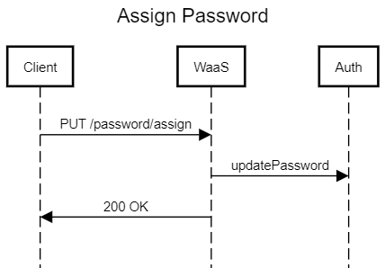

# Asignar Contraseña

Asigna una contraseña a un usuario global. A continuación se muestra el formato y los detalles de la solicitud:

## <span style='color: #e5e356;'>PUT</span> /password/assign
---
Asigna una contraseña al usuario global utilizando la autenticación de Usuarios Globales (JWT).

### Autenticación de Usuarios Globales (JWT)

```bash
curl --request PUT \
  --url '{baseUrl}/password/assign' \
  --header 'Authorization: JWT {token}' \
  --header 'Content-Type: application/json' \
  --data '{
    "password": "Koibanx123!"
}'
```

### Parámetros del Cuerpo (JSON)

- `password`: Contraseña que se asignará al usuario global.

## Respuestas Posibles

- `200 OK`: La contraseña se asignó con éxito.
- `4xx Bad Request`: Se produjo un error debido a una contraseña que no cumple con los requisitos. Consulta el cuerpo de la respuesta para obtener más detalles sobre el error.


## Diagrama de flujo:

