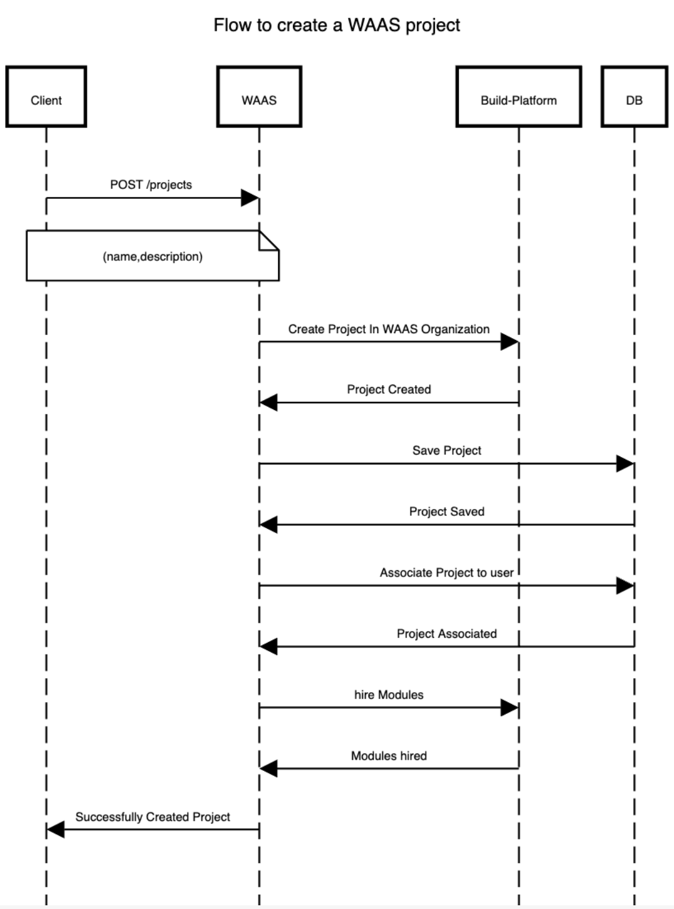

# Proyectos
## Crear Proyecto

Cuando se crea un proyecto, se asigna automáticamente a un usuario basándose en la autenticación utilizada durante la solicitud, para crear un proyecto solo está disponible la versión de autenticación con JWT.

### <span style='color: #81d294;'>POST</span> /projects
---

#### Autenticación de Usuarios Globales (JWT)
```bash
curl --request POST \
  --url {url}/projects \
  --header 'Authorization: JWT {token}' \
  --header 'Content-Type: application/json' \
  --data '{
  "name": "myProject",
  "description": "My Project description"
}'
```

### Parámetros del Cuerpo

- `name`: Nombre del proyecto.
- `description`: Descripción del proyecto.

### Respuestas
- `200 OK`: Se creo el proyecto con éxito, El cuerpo de la respuesta será un objeto JSON con los detalles del proyecto:

  - `apiKey`: Clave de API del proyecto.
  - `secret`: Clave secreta del proyecto.
  - `description`: Descripción del proyecto.
  - `name`: Nombre del proyecto.

```
{
	"apiKey": "c2626c59-324a-42da-b79f-690f39b350bf",
	"secret": "2Kach+Jqrl8KdaRFDTIbULW65X2exmm2WqrRyTi3W8HusS+l6JsHY8w==",
	"description": "My Project description",
	"name": "myProject",
}
```

Esta información será visible únicamente en esta ocasión.
### Diagrama de flujo


