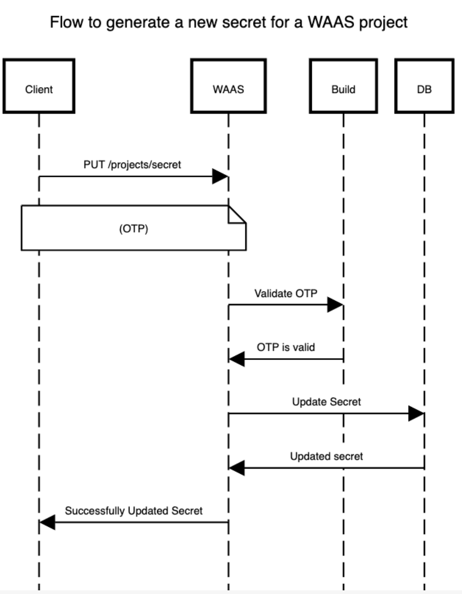

# Proyectos
## Generar nuevo secreto a un proyecto

Dado que el secreto de un proyecto no se puede recuperar, los usuarios tienen la opción de generar un nuevo secreto en caso de pérdida o por motivos de seguridad, para Generar nuevo secreto a un proyecto solo está disponible la versión de autenticación con JWT.


###  <span style='color: #e5e356'>PUT</span> /projects/secret
---

#### Autenticación de Usuarios Globales (JWT)
```bash
curl --request PUT \
  --url {url}/projects/secret \
  --header 'Authorization: JWT {token}' \
  --header 'Content-Type: application/json' \
  --header 'apikey: 45bf84cf-e9c7-4b2c-9a7e-363f83865441' \
  --data '{
	"otp": "123456"
}'
```
### Parámetros del Cuerpo

- `otp`: Código de verificación de un solo uso (OTP, por sus siglas en inglés) generado por el usuario.

### Respuestas
- `200 OK`: Se genero un nuevo secreto para el proyecto, El cuerpo de la respuesta será un objeto JSON con los detalles actualizados del proyecto:

  - `secret`: Nuevo secreto del proyecto.
  - `apiKey`: Clave de API del proyecto.
  - `description`: Descripción del proyecto.
  - `name`: Nombre del proyecto.

```
{
	"secret": "2Kach+Jqrl8KdaRFDTIbULW65X2exmm2WqrRyTi3W8HusS+l6JsHY8w==",
	"apiKey": "c2626c59-324a-42da-b79f-690f39b350bf",
	"description": "test",
	"name": "test",
}
```

Esta información será visible únicamente en esta ocasión.
### Diagrama de flujo


