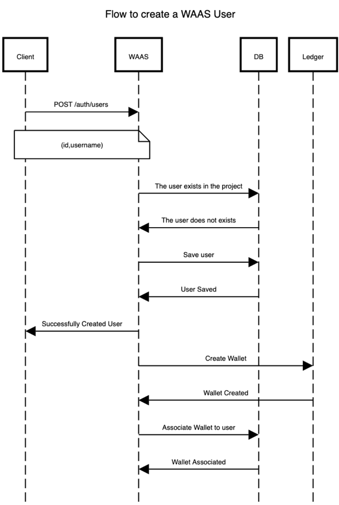

# Crear Usuario

Cuando se crea un usuario, se asigna automáticamente al proyecto basándose en la autenticación utilizada durante la solicitud.

## <span style='color: #81d294;'>POST</span> /{prefix}/users
---
### Autenticación de Usuarios Globales (JWT)

``` bash
curl --request POST \
  --url {url}/auth/users \
  --header 'Authorization: JWT {token}' \
  --header 'Content-Type: application/json' \
  --header 'apikey: {apikey}' \
  --data '{
	"username": "MyUser@koibanx.com",
	"id": "8f3f8da2-7529-4543-85fc-9ff492102760"
}'
```
### Autenticación de Proyectos (apiKey)

```bash
curl --request POST \
  --url '{url}/users' \
  --header 'Content-Type: application/json' \
  --header 'apiKey: {apiKey}' \
  --header 'secret: {Secret}'
   --data '{
	"username": "MyUser@koibanx.com",
	"id": "8f3f8da2-7529-4543-85fc-9ff492102760"
}'
```
### Parámetros del Cuerpo

- `username`: Nombre de usuario del nuevo usuario.
- `id`: Identificador único del nuevo usuario.

## Respuestas Posibles

- `200 OK`: Se creo el usuario con éxito. A continuación, se solicita a Ledger que genere una billetera (wallet) específica para este usuario.
- `4xx Invalid Parameters`: Se encontraron parámetros inválidos en la solicitud. El cuerpo de la respuesta contendrá información adicional sobre el error.
## Diagrama de flujo

