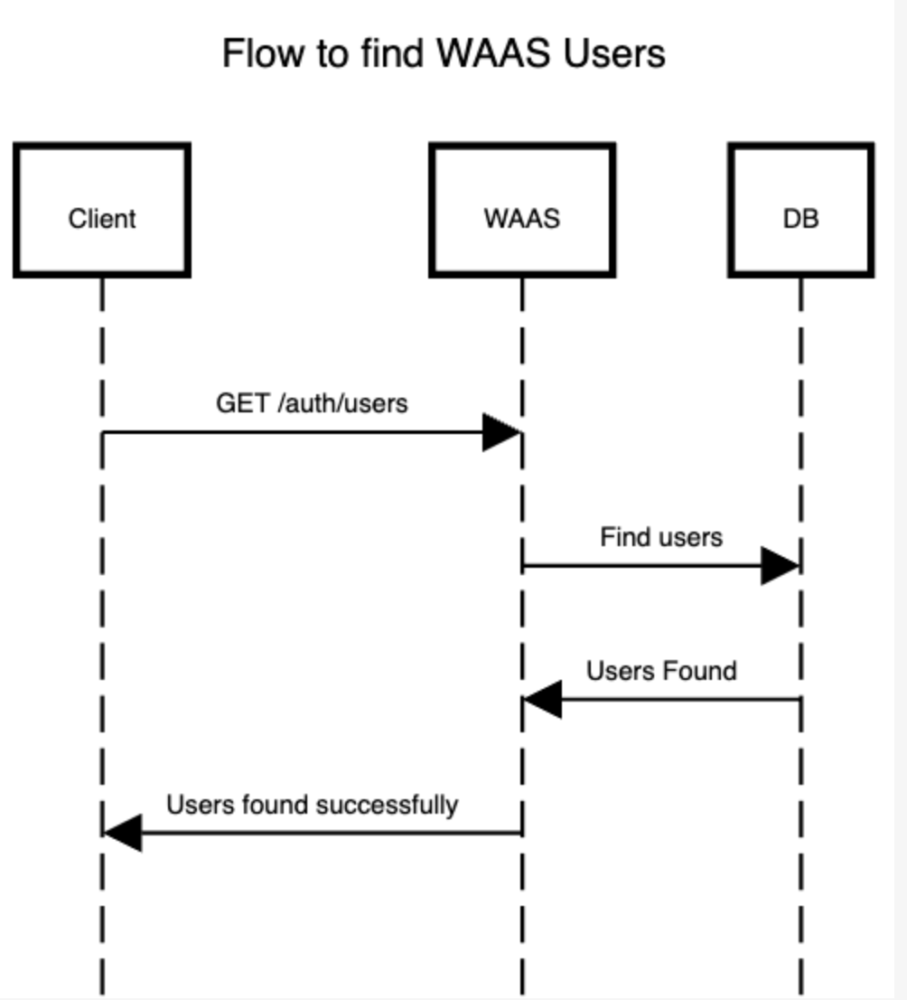

# Obtener Todos los Usuarios
Recupera los detalles de todos los usuario. Esta solicitud es filtra automáticamente por proyecto, basándose en la autenticación utilizada durante la solicitud.

## <span style='color: #6c8eef'>GET</span> /{prefix}/users?page=1&limit=10
---
### Autenticación de Usuarios Globales (JWT)

```bash
curl --request GET \
  --url '{baseUrl}/auth/users?page=1&limit=10' \
  --header 'Content-Type: application/json' \
  --header 'Authorization: JWT {JWT}' \
  --header 'apiKey: {apiKey}'
```

### Autenticación de Proyectos (apiKey)

```bash
curl --request GET \
  --url '{baseUrl}/auth-pair/users?page=1&limit=10' \
  --header 'Content-Type: application/json' \
  --header 'apiKey: {apiKey}' \
  --header 'secret: {Secret}'
```

## Parámetros de la URL

- `page` (opcional): Número de página para la paginación de resultados. Valor predeterminado: 1.
- `limit` (opcional): Número máximo de usuarios por página. Valor predeterminado: 10.

## Respuestas posibles

- `200 OK`: Se obtuvieron los usuarios con éxito. El cuerpo de la respuesta será una lista de objetos JSON, donde cada objeto representa un usuario con los siguientes detalles:

  - `username`: Nombre de usuario del usuario.
  - `projectId`: ID del proyecto al que pertenece el usuario.
  - `tokensHolding`: Lista de tokens que el usuario posee.
  - `id`: ID del usuario.

```json
[
	{
		"username": "MyUser@koibanx.com",
		"projectId": "45bf84cf-e9c7-4b2c-9a7e-363f83865441",
		"tokensHolding": [],
		"id": "8f3f8da2-7529-4543-85fc-9ff492102760"
	}
]
```
- `4xx Invalid Parameters`: Se encontraron parámetros inválidos en la solicitud. El cuerpo de la respuesta contendrá información adicional sobre el error.
## Diagrama de flujo


