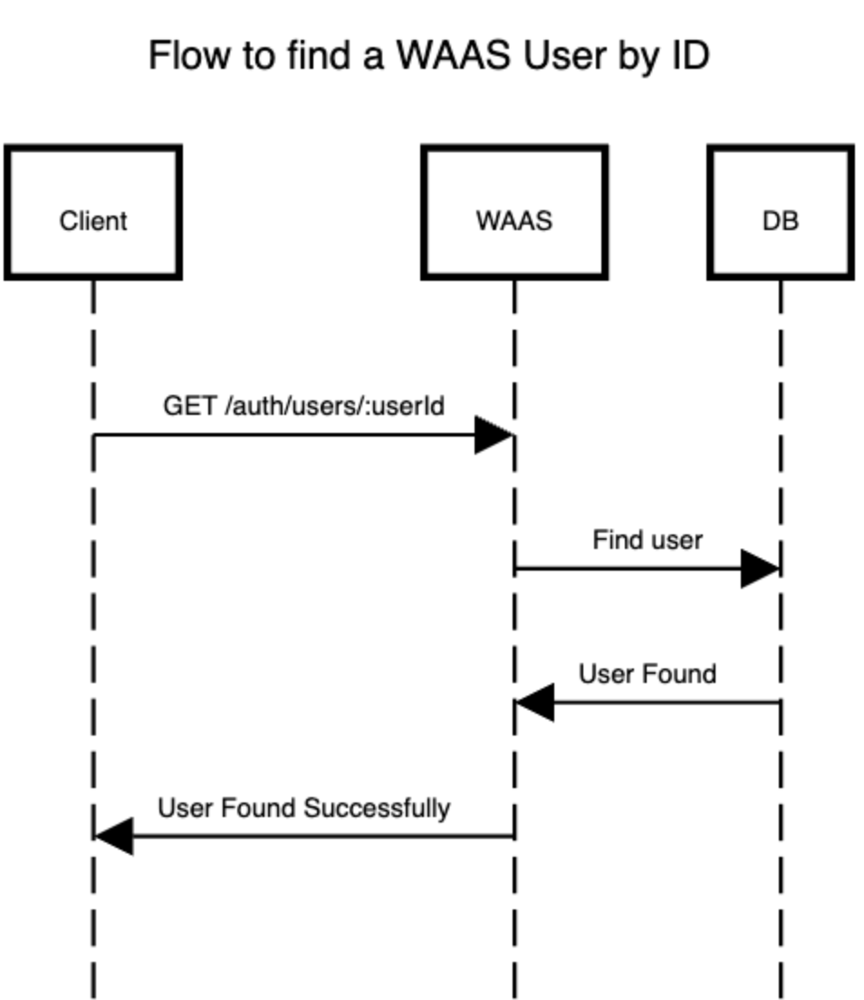

# Obtener Detalles de un Usuario por ID

Recupera los detalles de un usuario por su ID. Esta solicitud es filtra automáticamente por proyecto, basándose en la autenticación utilizada durante la solicitud.

## <span style='color: #6c8eef;'>GET</span> /{prefix}/users/{userId}
---
### Autenticación de Usuarios Globales (JWT)

```bash
curl --request GET \
  --url '{baseUrl}/auth/users/8f3f8da2-7529-4543-85fc-9ff492102760' \
  --header 'Content-Type: application/json' \
  --header 'Authorization: JWT {JWT}' \
  --header 'apiKey: {apiKey}'
```

### Autenticación de Proyectos (apiKey)

```bash
curl --request GET \
  --url '{baseUrl}/auth-pair/users/8f3f8da2-7529-4543-85fc-9ff492102760' \
  --header 'Content-Type: application/json' \
  --header 'apiKey: {apiKey}' \
  --header 'secret: {Secret}'
```

## Parámetros de la URL

- `userId`: ID del usuario que se desea obtener.

## Respuestas posibles

- `200 OK`: Se obtuvieron los detalles del usuario con éxito. El cuerpo de la respuesta será un objeto JSON con los detalles del usuario:

  - `username`: Nombre de usuario del usuario.
  - `projectId`: ID del proyecto al que pertenece el usuario.
  - `tokensHolding`: Lista de tokens que el usuario posee.
  - `id`: ID del usuario.

```json
{
	"username": "test.receiver@koibanx.com",
	"projectId": "45bf84cf-e9c7-4b2c-9a7e-363f83865441",
	"tokensHolding": [],
	"id": "8f3f8da2-7529-4543-85fc-9ff492102760"
}
```

- `404 Not Found`: No se encontró el usuario con el ID proporcionado. El cuerpo de la respuesta será un objeto JSON con la razón del error y un mensaje:

```json
{
	"reason": "NOT_FOUND",
	"msg": "User with id <45bf84cf-e9c7-4b2c-9a7e-363f83865441> does not exist"
}
```

## Diagrama de flujo

